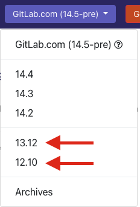

# Monthly documentation releases

When a new GitLab version is released on the 22nd, we release version-specific published
documentation for the new version.

We complete the process as soon as possible after the GitLab version is announced. The result is:

- The [online published documentation](https://docs.gitlab.com) includes:
  - The three most recent minor releases of the current major version. For example 13.9, 13.8, and
    13.7.
  - The most recent minor releases of the last two major versions. For example 12.10, and 11.11.
- Documentation updates after the 22nd are for the next release. The versions drop down
  should have the current milestone with `-pre` appended to it, for example `13.10-pre`.

Each documentation release:

- Has a dedicated branch, named in the format `XX.yy`.
- Has a Docker image that contains a build of that branch.

For example:

- For [GitLab 13.9](https://docs.gitlab.com/13.9/index.html), the
  [stable branch](https://gitlab.com/gitlab-org/gitlab-docs/-/tree/13.9) and Docker image:
  [`registry.gitlab.com/gitlab-org/gitlab-docs:13.9`](https://gitlab.com/gitlab-org/gitlab-docs/container_registry/631635).
- For [GitLab 13.8](https://docs.gitlab.com/13.8/index.html), the
  [stable branch](https://gitlab.com/gitlab-org/gitlab-docs/-/tree/13.8) and Docker image:
  [`registry.gitlab.com/gitlab-org/gitlab-docs:13.8`](https://gitlab.com/gitlab-org/gitlab-docs/container_registry/631635).

## Recommended timeline

To minimize problems during the documentation release process, use the following timeline:

- Between the 17th and the 20th of the month:

  1. [Create a stable branch and Docker image](#create-stable-branch-and-docker-image-for-release) for
     the new version.
  1. [Create a release merge request](#create-release-merge-request) for the new version, which
     updates the version dropdown menu for the current documentation and adds the release to the
     Docker configuration. For example, the
     [release merge request for 13.9](https://gitlab.com/gitlab-org/gitlab-docs/-/merge_requests/1555).

     Try to create the MR close to the cutoff for `gitlab` project's stable branch for the release.
     If the `gitlab-docs` MR is too early or late, a mismatch between the `gitlab` project's
     documentation files and the `gitlab-docs` global navigation can cause failed MR pipelines that
     must be manually fixed. To check the status of the `gitlab` release, go to the `#releases`
     Slack channel and look for the `This is the candidate commit to be released on the 22nd.`
     message.

  1. [Update the three online versions](#update-dropdown-for-online-versions), so that they display the new release on their
     version dropdown menus.

- On the 22nd of the month:

  [Merge the release merge requests and run the necessary Docker image builds](#merge-merge-requests-and-run-docker-image-builds).

## Create stable branch and Docker image for release

To create a stable branch of the `gitlab-docs` project and a Docker image for the release:

1. Make sure you're in the root path of the `gitlab-docs` repository.
1. Run the Rake task to create the single version. For example, to create the 13.9 release branch
   and perform other tasks:

   ```shell
   ./bin/rake "release:single[13.9]"
   ```

   A branch for the release is created, a new `Dockerfile.13.9` is created, and `.gitlab-ci.yml`
   has branches variables updated into a new branch. These files are automatically committed.

1. Push the newly created branch, but **don't create a merge request**. After you push, the
   `image:docs-single` job creates a new Docker image tagged with the name of the branch you created
   earlier. You can see the Docker image in the `registry` environment at
   <https://gitlab.com/gitlab-org/gitlab-docs/-/environments/folders/registry>.

For example, see [the 13.9 release pipeline](https://gitlab.com/gitlab-org/gitlab-docs/-/pipelines/260288747).

If the pipeline fails, the new Docker image is not created and so not added to the registry.

Optionally, you can test locally by:

1. Building the image and running it. For example, for GitLab 13.9 documentation:

   ```shell
   docker build -t docs:13.9 -f Dockerfile.13.9 .
   docker run -it --rm -p 4000:4000 docs:13.9
   ```

1. Visiting `http://localhost:4000/13.9` to see if everything works correctly.

## Create release merge request

**Note:** An [epic is open](https://gitlab.com/groups/gitlab-org/-/epics/4361) to automate this step.

To create the release merge request for the release:

1. Make sure you're in the root path of the `gitlab-docs` repository.
1. Create a branch `release-X-Y`. For example:

   ```shell
   git checkout main
   git checkout -b release-13-9
   ```

1. Edit `content/_data/versions.yaml` and update the lists of versions to reflect the new release:

   - Add the latest version to the `online:` section.
   - Move the oldest version in `online:` to the `offline:` section. There should now be three
     versions in `online:`.

1. Edit `Dockerfile.main` by removing the oldest version, and then adding the newest version to the top of the list.

1. Commit and push to create the merge request. For example:

   ```shell
   git add content/_data/versions.yaml Dockerfile.main
   git commit -m "Release 13.9"
   git push origin release-13-9
   ```

1. Create the merge request and choose the `Release` description
   template. Set the merge request to _Draft_ status and do not merge it yet.

## Update dropdown for online versions

To update `content/_data/versions.yaml` for all online versions (stable branches `X.Y` of the
`gitlab-docs` project).

### Update dropdowns for the current major version

1. Run the Rake task that creates the merge requests to update the dropdowns for the current major version. For
   example, for the 14.4 release:

   ```shell
   git checkout release-14-4
   ./bin/rake release:dropdowns
   ```

   For the 14.4 release, the task created the following three merge
   requests:

   - [Update the 14.4 version dropdown menu for the 14.4 release](https://gitlab.com/gitlab-org/gitlab-docs/-/merge_requests/2212).
   - [Update the 14.3 version dropdown menu for the 14.4 release](https://gitlab.com/gitlab-org/gitlab-docs/-/merge_requests/2213).
   - [Update the 14.2 version dropdown menu for the 14.4 release](https://gitlab.com/gitlab-org/gitlab-docs/-/merge_requests/2214).

1. [Visit the merge requests page](https://gitlab.com/gitlab-org/gitlab-docs/-/merge_requests?label_name%5B%5D=release)
   to check that their pipelines pass. Set each merge request to _draft_ status and do not merge them yet.

### Update dropdowns for the previous major versions

The previous major versions are listed under the current versions in the docs:



The process to update the dropdowns for the previous major versions is not automated,
so you must create the merge requests manually.
For simplicity, these steps assume you are updating the 13.12 and 12.10 dropdowns.
The steps should be updated when we move to the next major release (15.0).

1. Create a branch off the stable branch for 13.12.
   Use `update-13.12-for-release-<new-version>` for the branch name. For example:

   ```shell
   git checkout -b update-13.12-for-release-14.4 origin/13.12
   ```

1. Edit `content/_data/versions.yaml` and update the list of versions to reflect the new release:

   - Add the latest version to the `online:` section.
   - Remove the oldest version in `online:`. There should now be three
     versions in `online:`.

1. Commit and push. For example, for the 14.4 release:

   ```shell
   git add content/_data/versions.yaml
   git commit -m "Update dropdown to 14.4"
   git push origin update-13.12-for-release-14.4
   ```

1. Create the merge request:
   - For the target branch, select the previous version's stable branch, in this case, `13.12` (do not select `main`!)
   - Add the `~Technical Writing` and `~release` labels.
   - Set the merge request to _draft_ status.
   - [Example merge request](https://gitlab.com/gitlab-org/gitlab-docs/-/merge_requests/2219) for the 14.4 release.

1. Create a branch off the stable branch for 12.10.
   Use `update-12.10-for-release-<new-version>` for the branch name. For example:

   ```shell
   git checkout -b update-12.10-for-release-14.4 origin/12.10
   ```

1. Edit `content/_data/versions.yaml` and update the list of versions to reflect the new release:

   - Add the latest version to the `online:` section.
   - Remove the oldest **current** version from `online:`.

1. Commit and push. For example, for the 14.4 release:

   ```shell
   git add content/_data/versions.yaml
   git commit -m "Update dropdown to 14.4"
   git push origin update-12.10-for-release-14.4
   ```

1. Create the merge request:
   - For the target branch, select the previous version's stable branch, in this case, `12.10` (do not select `main`!)
   - Add the `~Technical Writing` and `~release` labels.
   - Set the merge request to _draft_ status.
   - [Example merge request](https://gitlab.com/gitlab-org/gitlab-docs/-/merge_requests/2220) for the 14.4 release.

1. [Visit the merge requests page](https://gitlab.com/gitlab-org/gitlab-docs/-/merge_requests?label_name%5B%5D=release)
   to check that their pipelines pass. Do not merge them yet.

## Merge merge requests and run Docker image builds

The merge requests for the dropdowns should now all be merged into their respective stable branches.

1. Check the [pipelines page](https://gitlab.com/gitlab-org/gitlab-docs/pipelines)
   and make sure all stable branches have green pipelines.
1. Merge all of the [dropdown merge requests](#update-dropdown-for-online-versions).
1. Merge the [release merge request](#create-release-merge-request).
1. Each merge triggers a new pipeline for each stable branch.
   Check the [pipelines page](https://gitlab.com/gitlab-org/gitlab-docs/pipelines) and wait
   for all the stable branch pipelines to complete.
1. Go to the [scheduled pipelines page](https://gitlab.com/gitlab-org/gitlab-docs/pipeline_schedules)
   and run the `Build docker images weekly` pipeline that builds the `:latest` Docker image.
1. In the scheduled pipeline you just started, manually run the **image:docs-latest** job.
1. When the pipeline is complete, run the `Build docs.gitlab.com every 4 hours` scheduled pipeline to deploy all new versions to the public documentation site.
   You don't need to run any jobs manually for this second pipeline.

## Post-deployment checklist

After the documentation is released, verify the documentation site has been deployed as expected.
Open site `docs.gitlab.com` in a browser and confirm both the latest version and the correct `pre-`
version are listed in the documentation version dropdown.

For example, if you released the 14.1 documentation, the first dropdown entry should be
`GitLab.com (14.2-pre)`, followed by `14.1`.

## Troubleshooting

### `Could not find remote branch` error

When you create the [stable branch](#create-stable-branch-and-docker-image-for-release)
or create the MRs to [update the dropdown](#update-dropdown-for-online-versions),
the pipeline fails with an error similar to the following:

```shell
warning: Could not find remote branch 5-3-stable to clone.
fatal: Remote branch 5-3-stable not found in upstream origin
```

This error occurs because the latest Charts stable branch hasn't been created yet.

This is fine! [Keep an eye on the Charts branches](https://gitlab.com/gitlab-org/charts/gitlab/-/branches)
and when the Charts branch is cut:

- If the error happens when you create the stable branch, go to the **Pipelines** page and run a new pipeline for your branch.
- If the error happens when you create the MRs to update the dropdown, return to your MR and run the pipeline again.

### image:docs-latest job fails with `GemNotFound` error

When you start the **Build docker images weekly** scheduled pipeline and
[run the **image:docs-latest** job](#merge-merge-requests-and-run-docker-image-builds),
the job fails with an error similar to the following:

```shell
bundler: failed to load command: rake (/usr/local/bundle/bin/rake)
Bundler::GemNotFound: Could not find <some gem>
```

This error can occur when there was a recent update to
dependencies in the [`Gemfile.lock`](https://gitlab.com/gitlab-org/gitlab-docs/-/blob/main/Gemfile.lock)
file, but the dependencies are missing from
the latest [`gitlab-docs:bootstrap`](https://docs.gitlab.com/ee/development/documentation/site_architecture/deployment_process.html) image.

1. Start a new **Build docker images weekly** pipeline.
1. Run the **image:bootstrap** job. This job creates a new bootstrap image
   and adds it to the container registry.
1. After the **Build** and **Test** stages are complete, run the **image:docs-latest** job.
